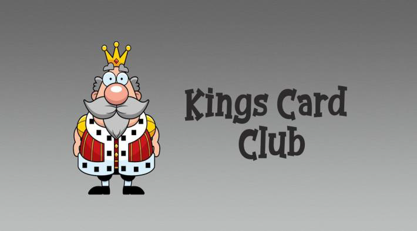
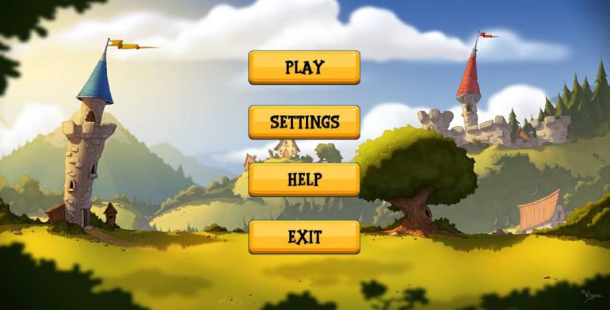
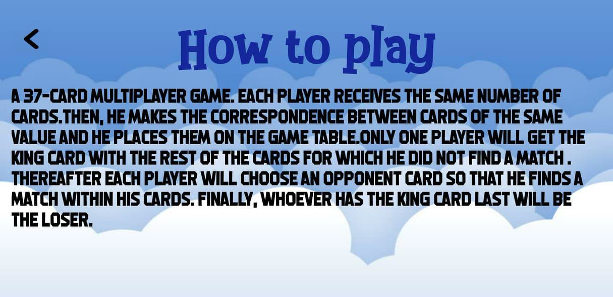
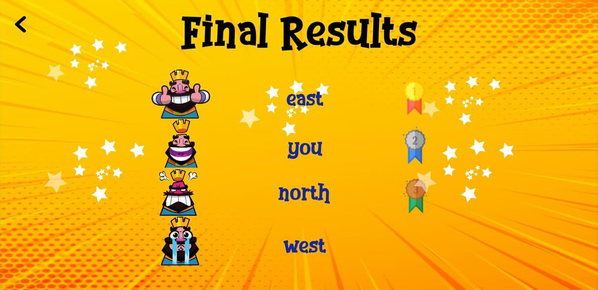
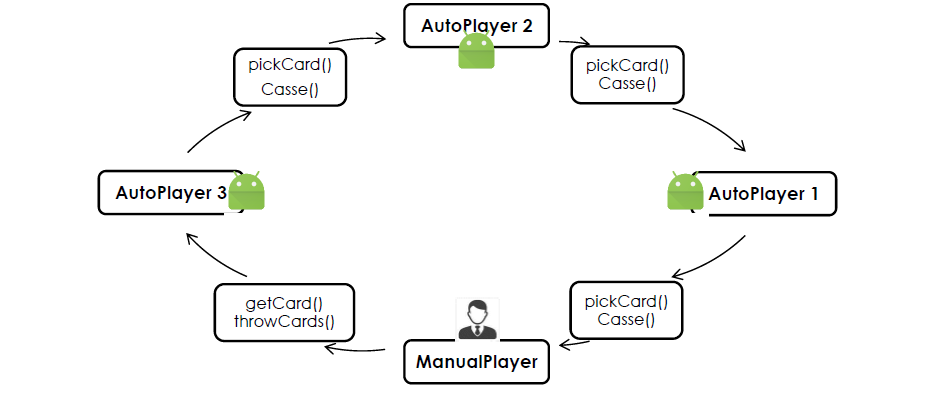

# Kings Card Club

## General Project Overview

### Introduction
This project is a mobile game for the Android platform, titled **"Kings Card Game"**, developed using **Android Studio**. The game is designed to be a fun and engaging multiplayer card game with a unique twist.

### Development Environment
After extensive research, we chose **Android Studio** as our development platform. Android Studio, provided by Google, is a powerful and free IDE specifically designed for Android app development. It offers a wide range of pre-defined tools that ensure speed and ease of development.

---

## Game Concept

### Number of Players:
- **4 Players** (3 AI players and 1 manual player controlled by the user)

### Number of Cards:
- **37 Cards**

### Rules:
- The game is a multiplayer card game where only one **King** exists among the four suits (hearts, clubs, spades, and diamonds).
- The cards are distributed among the four players.
- The game round begins by drawing a card from the left player's hand.
- The goal is to discard as many cards as possible by pairing those with the same value.
- The turn then passes to the right.
- A player who has no more cards leaves the game, and the **last player holding the King loses**.

---

## Architecture & Design

### Introduction
The game is developed using **Android Studio**, which is based on **Java**. Java's object-oriented nature allows us to effectively model various aspects and properties of the application.

### Key Concepts Used:
- **Object-Oriented Programming**
- **Inheritance and Polymorphism**
- **Animations** for different objects (Text, Image, etc.)
- **Sound effects**

---

## Application Structure

### Home Interface
- An **introductory animation** appears when the game is launched.

- The **main menu** provides options to:
  - Start the game
  - Learn the rules
  - Quit the application
  

### Settings Interface
- Users can customize:
  - **Language** (French, English, German)
  - **Game background** (table design)
  - **Card colors**
  - **King character**
  - **Enable/Disable sound**

### Help Interface
- Guides the player in understanding the game mechanics.

### Main Interface
- The **game cycle** takes place here.
- The **manual player** (controlled by the user) is positioned at the bottom of the screen.
- The **three AI players** control the other positions.

### Final Interface
- Displays the **player rankings** at the end of the game.

---

## Programming & Class Hierarchy

### Object-Oriented Programming
To ensure a dynamic application, **object creation** is essential for simplifying development and minimizing code complexity. This highlights the importance of **object-oriented programming** principles.

### Class Hierarchy
The following diagram represents the different classes used and their relationships:

### Game Flow

Below is the diagram summarizing the flow of turns between players and the associated functions:

### Classes:
- **Card**: The main class responsible for defining cards with attributes like value, suit, and face.
- **Settings**: Manages game parameters, saving user preferences.
- **Songs**: Handles background music in different interfaces.
- **Game**: Manages card distribution, player turns, and determines the winner.
- **Player**: An abstract class defining attributes and methods shared by all players.
  - **AutoPlayer**: Controls AI players and their decision-making.
  - **ManualPlayer**: Allows user interactions and manual decision-making.

---

### Card Class

| Attribute/Method         | Description                                                                 |
|--------------------------|-----------------------------------------------------------------------------|
| `face / back`            | Image of the front and back of the card                                     |
| `suit`                   | String indicating the card's suit (clubs, hearts, diamonds, spades)         |
| `value`                  | Integer representing the card's value (1,2,3...K)                           |
| `positionX / positionY`  | Stores the card's position on the screen (X, Y)                             |
| `addToTable()`           | Adds the card to the center of the screen after creation                    |
| `flip()`                 | Flips the card between front and back                                       |
| `setXTranslator() / setYTranslator()` | Moves the card along X and Y coordinates                     |
| `rotate()`               | Rotates the card for proper orientation                                     |
| `fadeIn() / fadeOut()`   | Makes the card appear/disappear                                             |
| `zoom()`                 | Enlarges the card size                                                      |

---

### Game Class

| Attribute/Method         | Description                                                                 |
|--------------------------|-----------------------------------------------------------------------------|
| `fullDeck`               | A list containing all 37 cards                                              |
| `players`                | A list of 4 players (3 AI, 1 manual)                                        |
| `winners`                | A list of players ranked at the end of the game                             |
| `distributeCards()`      | Shuffles and distributes the 37 cards                                       |
| `addPlayerToGame()`      | Adds a player to the game                                                   |
| `setBoardText()`         | Displays animated text messages during gameplay                             |

---

### Player Class
This is an abstract class defining the common characteristics of both AI and manual players.

| Attribute/Method         | Description                                                                 |
|--------------------------|-----------------------------------------------------------------------------|
| `sittingPosition`        | Indicates player position (South, North, East, West)                        |
| `cards`                  | Array containing the player's hand                                          |
| `throwCards()`           | Allows the manual player to discard compatible pairs                        |
| `pickCard()`             | Allows an AI player to randomly pick a card from the left player            |
| `getCard()`              | Allows the manual player to pick a card from a neighbor                     |
| `casse()`                | Automatically removes matching pairs                                        |

---

### AutoPlayer Class
This class controls the three AI players.

| Attribute/Method         | Description                                                                 |
|--------------------------|-----------------------------------------------------------------------------|
| `pickCard()`             | Picks a random card from the neighboring player                             |
| `casse()`                | Removes compatible cards                                                    |
| `fixDeckAfterCasse()`    | Re-aligns the deck after removing pairs                                     |
| `lookForCasse()`         | Searches for matching card pairs and removes them                           |

---

### ManualPlayer Class
This class defines the player's manual interactions.

| Attribute/Method         | Description                                                                 |
|--------------------------|-----------------------------------------------------------------------------|
| `cardToThrow`            | Array of two selected cards for removal                                     |
| `getCard()`              | Allows the player to pick a card from a neighbor                            |
| `arrangeDeck()`          | Organizes the deck after modifications                                      |
| `throwCards()`           | Verifies and removes selected card pairs                                    |
| `cardsAreCompatible()`   | Checks if selected cards have the same value                                |
| `setCardsListeners()`    | Enables card interaction for the user                                       |

---

## Gameplay Actions

- **Picking a Card**: The user presses the **"Pick Card"** button to open a selection interface and choose a card from the neighboring player's hand.
- **Discarding Cards**: Unlike AI players, the manual player must manually select two matching cards and press the **"Throw Cards"** button. The system then verifies their compatibility before removing them.

---

This document provides a structured overview of the **"Kings Card Game"** project, detailing its rules, development environment, game architecture, and class hierarchy.